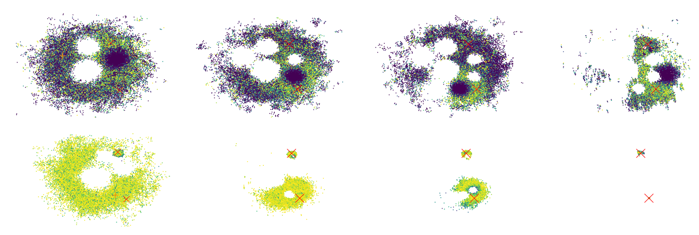

## Code Base for PASOA- PArticle baSed Bayesian Optimal Adaptive design (ICML 2024)
<p align="center">

</p>


https://arxiv.org/abs/2402.07160

This repo was tested using Python 3.11 . Required packages can be install using conda:

```
conda env create -n ENVNAME --file environment.yml
```

To reproduce the results, you can run:

## Sources
```
python sources.py --num_meas=31 --inner_samples=100 --outer_samples=200 --num_sources=2 --name=TSMC --rng_key=1 --iter_per_meas=3000
```
Runs in ~120s on an Apple M1Pro CPU, add --plot_post for plots of the procedure.

## CES
```
python ces.py --inner_samples=100 --outer_samples=400 --num_meas=11  --rng_key=1 --name=TSMC
```
Runs in ~5m on an Apple M1Pro CPU, add --plot_post for plots of the procedure.
